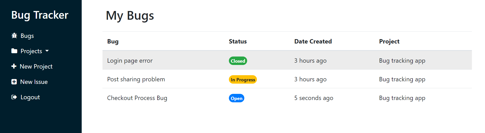
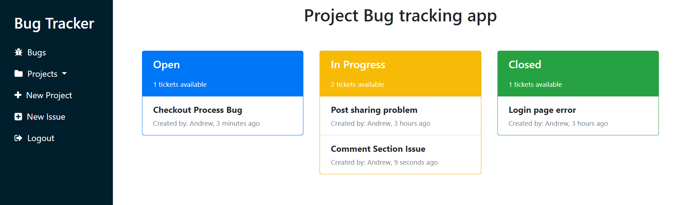

# Bug Tracking App

Bug Tracking App is a web application for tracking bugs and issues in software projects.

## Table of Contents
- [Introduction](#introduction)
- [Features](#features)
- [Technologies Used](#technologies-used)
- [Installation](#installation)
- [Screenshots](#Screenshots)
- [Deployment](#deployment)

## Introduction

Bug Tracking App is a web application built with Flask that allows users to track and manage bugs and issues in their projects.

## Features

- User authentication: Users can sign up, log in, and log out securely.
- Create Projects: Users can create new projects to organize their bug tracking tasks.
- Create Bugs: Users can create new bugs within a project, providing a title, description, and status.
- Update Bugs: Users can update the status of bugs as they progress through different stages.
- Dashboard: Users can view and manage their assigned bugs in the dashboard.

## Technologies Used

- Flask: A lightweight web framework for Python.
- SQLite: A lightweight, serverless database for storing bug and user data.
- Bootstrap 4: A front-end framework for responsive and modern UI design.
## Installation

1. Clone the repository:
 ```bash
   git clone https://github.com/AndrewMaged814/Bug-Tracking.git
   ```
2. Change directory to the project folder:
 ```bash
   cd Bug-Tracking
   ```
3. Create and activate a virtual environment (optional but recommended):
 ```bash
   # For Windows
python -m venv venv
venv\Scripts\activate

# For macOS and Linux
python3 -m venv venv
source venv/bin/activate
   ```

4. Install the dependencies:    
 ```bash
   pip install -r requirements.txt
   ```

## Screenshots
_Dashboard page which show the bugs assgined to a user._



_Page which shows bugs specfic to a project._ 



## Deployment

The Bug Tracking App has been deployed using PythonAnywhere and is accessible at the following link: [Bug Tracking App](http://andrewmaged.pythonanywhere.com/).

Feel free to explore the live application and test its features!
